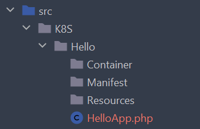

# Apps
App is one of the basic concepts in Dealroadshow K8S Framework. You've probably already heard of **Helm Charts**. *App* in K8S Framework means the same thing - it is a collection of related [manifests](manifests.md) that will be dumped together. What are criteria of moving some set of Kubernetes resources to app? Well, this Kubernetes resources should be *related*, but what does *related* means in this context? Generally this should mean that a set of manifests must be deployed together. So you may define an app as a set of Kubernetes manifests for a single service in SOA architecture, or for a microservice in microservice architecture. If you have a big monolith platform - you are probably thinking on how to split it into smaller pieces, which can be deployed separately. The same criteria may apply to corresponding manifests. 

Every app must implement **`AppInterface`**. Let's see what method this interface defines:

```php
interface AppInterface extends ConfigurableInterface
{
    public static function name(): string;

    /**
     * @return string The alias with which app was registered in AppRegistry
     */
    public function alias(): string;

    public function addManifestFile(string $fileNameWithoutExtension, APIResourceInterface $resource): void;
    public function metadataHelper(): MetadataHelperInterface;
    public function namesHelper(): NamesHelperInterface;
    public function manifestNamePrefix(): string;
    public function manifestConfig(string $shortName): array;

    /**
     * @return ManifestFile[]
     */
    public function manifestFiles(): iterable;
}

```

Below, by walking through some important methods of **`AppInterface`**, we will better understand app's role. We don't discuss methods `addManifestFile()`, `metadataHelper()`, `namesHelper()`, `manifestConfig()` and `manifestFiles()` here - these are internal methods and they are not needed for you to understand apps. Some of this methods are discussed in other articles.

## Names and aliases
Method `AppInterface::name()` defines default name of an app. What "*default*" means here? As you can see, this method is static, so different instances of an app class cannot return different names. But when do you need more than one instance of the same app class? Well, suppose you have `RedisApp` that contains manifests for [Redis](https://redis.io/) cluster:

```php
namespace K8S\Redis;

use Dealroadshow\K8S\Framework\App\AbstractApp;

class RedisApp extends AbstractApp
{
    public static function name(): string
    {
        return 'redis';
    }
}

```

If you need just one Redis cluster - you don't need to configure anything. But what if you need two or more Redis clusters? It is possible to use `RedisApp` class to generate as many app copies as you need. All you have to do is [register](../lifecycle.md#collecting-app-instances) one `RedisApp` instance in `AppRegistry` for every cluster you want. So if you need Kubernetes manifests for two clusters - you need to register two `RedisApp` instances with different *aliases*. If you use [K8S Bundle](https://github.com/dealroadshow/k8s-bundle) with Symfony application (recommended way of using [K8S Framework](https://github.com/dealroadshow/k8s-framework)), framework will register them for you - just configure them in `config/packages/dealroadshow_k8s.yaml` file:

```yaml title="dealroadshow_k8s.yaml" linenums="1"
dealroadshow_k8s:
  apps:
    - alias: first-redis
      class: App\K8S\Redis\RedisApp
    - alias: second-redis
      class: App\K8S\Redis\RedisApp
    - alias: redis
      class: App\K8S\Redis\RedisApp
      enabled: false # You need to explicitly disable app registration by it's name() method
```

!!! attention "Important"
    Please note lines 7-9 in config above: we register two apps, `first-redis` and `second-redis` with `RedisApp` class, but without lines 7-9 there will be third app `redis` - class `RedisApp` will be found by Symfony DI as any other app class and will be added by it's name `redis`. So in order to avoid "default" app registration - register it explicitly by name, returned from app's method `name()`, and add option `enabled: false`.

So `alias` is a dynamic app name, that allows to have many different instances of the same app class with different names. And since by [manifests naming convention](manifests.md#manifest-names) all manifest names are prefixed with app alias - this ensures that there will be no two manifests with the same name when you generate two copies of an app. 

Let's demonstrate this with example. Suppose you have class `ClusterStatefulSet` in your `RedisApp`:

```php
namespace K8S\Redis\Manifest;

// ...

class ClusterStatefulSet extends AbstractContainerStatefulSet
{
    public static function shortName(): string
    {
        return 'cluster';
    }
    
    // other methods
}

```

If you need just one Redis cluster and you did not configure any aliases in config file - Symfony will find your `RedisApp` class, and will create and register instance by alias, taken from `RedisApp::name()` method - thus when you dump manifests you'll have directory `redis` and manifest file` redis/cluster.stateful-set.yaml`:

```yaml title="redis/cluster.stateful-set.yaml" linenums="1"
apiVersion: apps/v1
kind: StatefulSet
metadata:
  labels:
    app: redis
    component: cluster
  name: redis-cluster
# ...
```

As you see, StatefulSet will have name `redis-cluster`.

However, if you configure two aliases like shown above, after dumping manifests you'll have directories `first-redis` and `second-redis`, files `first-redis/cluster.stateful-set.yaml` and `second-redis/cluster.stateful-set.yaml` with corresponding names `first-redis-cluster` and `second-redis-cluster`.

### Generating manifest only for a subset of apps
Suppose we have configured few instances of our `RedisApp` like in example above. Then, suppose we have some manifest class that we want to be generated only for `second-redis` app, but not for `first-redis`. This is easily done by using `EnabledForApps` PHP [attribute](https://www.php.net/manual/en/language.attributes.overview.php) that comes with K8S Framework:

```php
#[EnabledForApps('second-redis')]
class MyExclusiveDeployment extends AbstractContainerDeployment
{
    public static function shortName(): string
    {
        return 'exclusive';
    }
    
    // ...
}
```

As a result, there will be generated file `second-redis/exclusive.deployment.yaml` but no `first-redis/exclusive.deployment.yaml`.

### Accessing app alias inside manifest classes
Sometimes you need app alias in a manifest class. As mentioned in [Manifests](manifests.md#using-app-object-inside-manifests) article, you may access app instance in any manifest by inherited property `$app`. So when you need app alias, access it like `$this->app->alias()`:

```php
class ClusterStatefulSet extends AbstractContainerStatefulSet
{
    public function selector(SelectorConfigurator $selector): void
    {
        $selector
            ->addLabel('app', $this->app->alias())
            ->addLabel('component', static::shortName())
        ;
    }
    
    // other methods
}
```

Every app instance will have it's alias injected by K8S framework, so feel free to use method `AppInterface::alias()` on any app object.

### Summary

So, to summarize information about app names and aliases: in most of cases you don't need to configure app with aliases - by default they will be registered by their name, and alias will be the same as name. Configure app class with different aliases if you need more than one copy of the app generated.

## Configuring manifest name prefixes
Method `AppInterface::manifestNamePrefix()` is implemented in `AbstractApp` class and makes [default naming convention](manifests.md#manifest-names) work:

```php title="AbstractApp.php"
public function manifestNamePrefix(): string
{
    return $this->alias;
}
```

This method result is then used in `DefaultNamesHelper` class, which generates names for Kubernetes resources during manifests generation. It means that if you don't want your resource names to be prefixed with app names - just return an empty string from this method in your app class. Please read [dedicated article](../howtos/change-naming-convention.md) if you want to change naming convention entirely.

## App's directory structure
Console command `k8s:generate:app` that comes with K8S Bundle generates app class and certain directory structure, which is a *recommended* but not mandatory way to structure your apps. By default your generated app will look like follows:



Let's take a closer look at this structure. Every app class is stored in a dedicated directory / namespace, for example `HelloApp` class will be stored in `K8S\Hello` namespace, `RedisApp` - in `K8S\Redis` namespace and so on.
At top level of app directory there is app class itself and few nested directories.

### `Container` dir
Store your [container](containers.md) classes in this directory. Note that this does not applies to `Container`-prefixed manifest classes, like classes that inherit from `AbstractContainerDeployment`. Most of the time you don't have separate container classes, so this directory is often deleted from generated app skeleton.

### `Manifest` dir
This is a most important directory in your app, since you should create your manifest classes in it. You may want to have some nested directories here, like `Manifest\Deployments`, `Manifest\ConfigMaps` and so on - feel free to create directory structure you like - Symfony and K8S framework will find and register your manifest classes by interfaces they implement, not by some exact file location.

### `Resources` dir
If your app class extends `AbstractApp`, it will have method `readFile()`. Suppose your app has a deployment for some web service, and you want to mount config for your Nginx webserver from some [ConfigMap](https://kubernetes.io/docs/concepts/configuration/configmap/). If you store nginx config in your ConfigMap class like string literal - it would be ugly. Instead you can store your nginx config as `Resources/nginx.conf` and then use method `AbstractApp::readFile()` to store it in your ConfigMap:

```php
class NginxConfigMap extends AbstractConfigMap
{
    public function data(StringMap $data): void
    {
        $data->add('config', $this->app->readFile('nginx.conf'));
    }

    public static function shortName(): string
    {
        return 'nginx';
    }
}
```

You may even want to implement more complex logic in your app class, for example method `compileTemplate()`- like if you want your nginx config to be generated from [Twig](https://twig.symfony.com/) template. In any of such scenarios, `Resources` dir is a place to store auxiliary files for your manifests.

## Summary
In this article we got to know concept of apps better. If you did not yet read about [containers](containers.md) - you should probably get to that article. You may also be interested in general [lifecycle](../lifecycle.md) of manifest generation application.