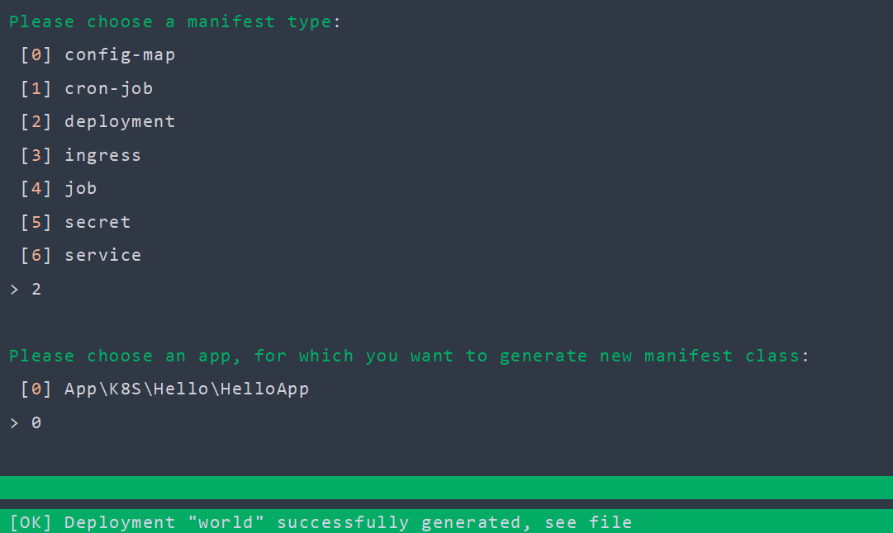
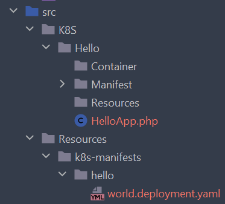

# Getting started
## Prerequisites
This tutorial assumes you have already [installed](installation.md) K8S Bundle.
The entire Dealroadshow K8S Framework docummentation also assumes that you are already familiar with basic Kubernetes concepts and have at least some experience with the Kubernetes itself. If not - please learn Kubernetes before using this framework.

## Create an App
[App](concepts/apps.md) is a basic concept in K8S Framework, similar to *chart* in **Helm** or, well, *app* in **cdk8s**. Put simply - app is a collection of *manifests*. Basically you will create app to define manifests for one of your services in SOA architecture - in order to distinguish this manifests from other service's manifests. If you have a "good old" monolith, your manifests may be split into apps using some other criteria, such as *domain contexts* in DDD ideology.

To create an app - simply open terminal and generate app class using Symfony command, shipped with K8S Bundle:

```bash
bin/console k8s:generate:app hello
```
If you did not modify K8S Bundle configuration, this command will generate new directory `K8S/Hello` in your sources dir (by default `src` in Symfony projects), app class `HelloApp` and basic dirs that you might want to have in an app:


!!! tip "Tip"

    To understand app's directory structure better, please read
    [dedicated article](concepts/apps.md) for apps.

If you open `HelloApp.php` file in IDE of your choice - you will see pretty basic class:

```php title="HelloApp.php"
class HelloApp extends AbstractApp
{
    public static function name(): string
    {
        return 'hello';
    }

    public function manifestConfig(string $shortName): array
    {
        return [];
    }
}

```

Method `HappyApp::name()` is self-explanatory, and other methods are explained in [dedicated article](concepts/apps.md).

## Define your first Deployment
Now that we have `HelloApp`, let's define our first [Deployment](https://kubernetes.io/docs/concepts/workloads/controllers/deployment/). Defining deployment using K8S Framework is as simple as defining it's corresponding PHP class for it. We could create deployment class by ourselves, but it would be simpler to generate it using console command:

```bash
bin/console k8s:generate:manifest world
```

`world` in command above is simply a short name for manifest. Command will ask you about type of your new manifest and an *app*, where to generate your new manifest:



Let's look at our new deployment class in `src/K8S/Hello/Manifest/WorldDeployment.php`:

```php title="WorldDeployment.php"
class WorldDeployment extends AbstractContainerDeployment
{
    public function image(): Image
    {
        return Image::fromName('my-cool/image');
    }
    
    public function selector(SelectorConfigurator $selector): void
    {
        $selector
            ->addLabel('app', $this->app->alias())
            ->addLabel('name', static::shortName())
        ;
    }

    public static function shortName(): string
    {
        return 'world';
    }
}

```

This class is pretty basic too, but it's already a valid Kubernetes deployment!

## Dump manifests
Let's dump your first manifest to standard Kubernetes YAML and look at it:

```bash
bin/console k8s:dump:all
```

After running this command we can see our new deployment dumped to file `src/Resources/k8s-manifests/hello/world.deployment.yaml`:



Let's look at this file:

```yaml title="hello/world.deployment.yaml" linenums="1"
apiVersion: apps/v1
kind: Deployment
metadata:
  labels:
    app: hello
    name: world
  name: hello-world
spec:
  replicas: 1
  selector:
    matchLabels:
      app: hello
      name: world
  template:
    metadata:
      annotations:
        dealroadshow.com/env-sources-checksum: d41d8cd98f00b204e9800998ecf8427e
        dealroadshow.com/volume-sources-checksum: d41d8cd98f00b204e9800998ecf8427e
      labels:
        app: hello
        name: world
    spec:
      containers:
        -
          image: my-cool/image
          imagePullPolicy: IfNotPresent
          name: app

```

Few things to note here.

*First*, look how deployment name is formed in **line 7**: as you may already guessed,  name `hello-world` is a concatenation of app name, returned from `HelloApp::name()` method, and manifest *short name*, returned from `WorldDeployment::shortName()`. Good news is you will not have to work with full manifest names in your code, but more on
that later.

*Second*, look at **lines 17-18**. This annotations guarantee that your pods will be recreated whenever any ConfigMaps or Secrets, used in your deployment, changed. You are welcome!

## Modifying deployment

For now we have defined our first deployment. It uses a dummy image name  `my-cool/image`. Let's replace it for a real image name. For demonstration purposes let it be `nginx`:

```php title="WorldDeployment.php"
// ...
public function image(): Image
{
    return Image::fromName('nginx');
}
```

[Nginx](https://nginx.org) is an open source web-server, so now that we use it, we know that we should expose some ports to the outside world. In Kubernetes manifests it is done by `ports` section. Dealroadshow K8S Framework follows simple rule: all method names in manifest classes are the same as names in corresponding sections in Kubernetes manifest. It means we should just try to define a method `ports()` in our deployment. In order to better understand all conventions and best practices for K8S framework, please read [Understanding manifests](concepts/manifests.md)

If you are using a good IDE, for example PhpStorm, just write down first letters `por` and IDE will create this method for you:

```php title="WorldDeployment.php"
//...
public function ports(PortsConfigurator $ports): void
{
}
```

Signature of argument `$ports` is pretty straightforward and simply following your IDE hints you could lead you to the something like this:

```php title="WorldDeployment.php"
//...
public function ports(PortsConfigurator $ports): void
{
    $ports
        ->add(80)
        ->setName('http');

    $ports
        ->add(443)
        ->setName('https');
}
```


## Define a service
Now we need to define a Kubernetes service in order to expose our deployment. As you may have already guessed - we will generate PHP class for service:

```bash
bin/console k8s:generate:manifest world
```

After chosing `service` as a kind of manifest you will get pretty basic service class `WorldService`.You can intuitively (and with help of IDE) define service ports in `ports()` method, but we should also add a `selector()` method in order for service to point properly to our pods. After this simple modifications our service class should look like follows:

```php title="WorldService.php"
class WorldService extends AbstractService
{
    public function ports(ServicePortsConfigurator $ports): void
    {
        $ports
            ->add(80, 80)
            ->setName('http');

        $ports
            ->add(443, 443)
            ->setName('https');
    }

    public function selector(StringMap $selector): void
    {
        $selector
            ->add('app', $this->app->alias())
            ->add('name', static::shortName())
        ;
    }

    public static function shortName(): string
    {
        return WorldDeployment::shortName();
    }
}

```

!!! tip "Good to know"
    Please note how we defined short name for a service by reusing short name of deployment.It is a good practice to use deployment name in service, and service name in ingress - in further articles we will learn techniques of how to automatically define selectors and ports for our services based on it's names.

If you dump your manifests now by console command `k8s:dump:all`, you'll get your deployment and a service pointing to deployment's pods. In other articles we dive deeper into defining manifests and internals of K8S Framework.
